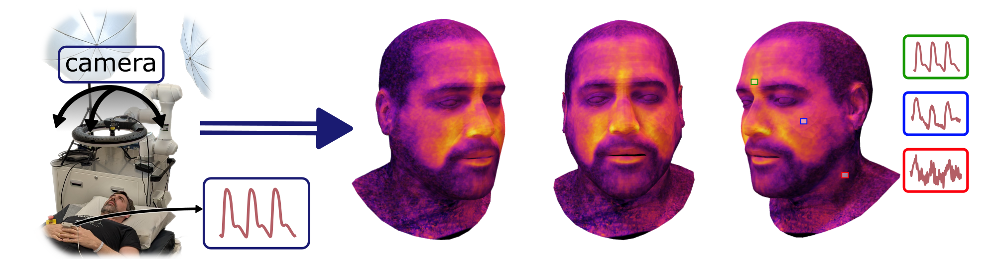

# Pulse3DFace Dataset : 3D Blood Pulsation Maps

Pulse3DFace is a dataset for estimating 3D blood pulsation maps from video data via remote Photoplethysmography.
It contains raw video collected from multiple angles under strong illumination conditions as well as the 3D reconstructed texture maps in the FLAME texture space.

FLAME is a morphable 3D animateable face model.
Information on how to use FLAME can be found on [flame.is.tue.mpg.de](https://flame.is.tue.mpg.de/).



## Publication

The paper is available on [arXiv](https://arxiv.org/abs/2512.10517).
If you use the dataset in your work, please cite

```bibtex
@misc{rohr2025pulse,
      title={3D Blood Pulsation Maps}, 
      author={Maurice Rohr and Tobias Reinhardt and Tizian Dege and Justus Thies and Christoph Hoog Antink},
      year={2025},
      eprint={2512.10517},
      archivePrefix={arXiv},
      primaryClass={cs.CV},
      url={https://arxiv.org/abs/2512.10517}, 
}
```

## Get Access

Access to the full dataset can be requested [here](https://docs.google.com/forms/d/e/1FAIpQLSdYhONDaLi7lubAI0gw_NBh2Cu15gT00WJrImOJ6Ps6FBUVvg/viewform?usp=sharing).

> Google Forms requires to use a google account to enable file upload, but only the email address entered into the respective field is saved by us and used to send you a summary of the entered data.

Example data for a single subject is provided [here](https://drive.google.com/drive/folders/1pFv7-5n5f9zf4uOs7l6_aR6SkgQdApFb?usp=sharing).

## Recording Setup
- **Camera**: *FLIR Blackfly* RGB camera (BFS-U3-50S5C-C) (30 FPS)
- **Illumination**: two studio lights with softboxes (*Proxistar*, LED 35 W, 5500°K, softbox diameter 84 cm) and a LED ring light (*Walimex Pro Medow* 960, 96 W, adjusted to 5500°K, outer diameter 45 cm)
- **Reference-PPG**: *Shimmer ear-clip* or *biosignalsplux BVP* finger sensor, Sampling-rate 128 Hz

## Data Format


Calibration data and photos used for facial 3D reconstruction are saved as `.jpeg`. Video recordings are saved as uncompressed `.avi` in I420 Pixel format. Reference PPG recorded along the videos is saved as `.csv` and was synchronized based on UNIX-timestamps.
The reference file contains samples at 128 Hz and has the columns `ppg_mv,ibi_ms,hr_bpm` each indicating the respective unit. "IBI" refers to the inter-beat interval between two consecutive heart beats estimated from the PPG. The value is -1  at all indices that do not represent a peak. "HR" is the instantaneous heart rate.

The computed pulse maps are saved as monochrome 16 bit `.png` images. \
The pixel unit range \[0,1\] maps to physical units as follows:
- SNR maps: \[-10,2\] dB 
- Amplitude maps:  \[0,0.4] normalized units (also relative to color channel average)
- Phase maps: \[-180,180\] °

The folder structure is as follows:
```
dataset
│   README.md
│
└──raw
│   │
│   └───S01
│   │   │
│   │   └───calibration.zip           (8 images)
│   │   |   │   image_at_r42.0cm_theta0_phi0_20250128_143628.png                
│   │   |   │   image_at_r42.0cm_theta5_phi-180_20250128_143633.png          
│   │   |   │   ...
│   │   │
│   │   └───3d_scan.zip               (XX images)
│   │   |   │   image_at_r42.0cm_theta0_phi0_20250128_145854.png                      
│   │   |   │   image_at_r42.0cm_theta6_phi0_20250128_145647.png
│   │   |   │   ...
│   │   │
│   │   └───ppg_ref.zip               (21 references)   
│   │   |   │   r42.0_theta0_phi0_ref.csv
│   │   |   │   r42.0_theta15_phi0_ref.csv                                       
│   │   |   │   ...
│   │   │
│   │   └───video                     (21 videos)
│   │   |   │   r42.0_theta0_phi0_20250127_092225_23070166-0000.avi
│   │   |   │   r42.0_theta0_phi0_20250127_092225timestamps.csv                          
│   │   |   │   r42.0_theta30_phi0_20250127_092225_23070166-0000.avi
│   │   |   │   r42.0_theta30_phi0_20250127_092225timestamps.csv
│   │   
│   └───S02
│   │   │
│   │   └───calibration.zip
│   │   |   │   ...
│   └───S03
│   |   | ...
│
│
└──processed
    │
    └───textured_models
    │   │
    │   └───S01.zip
    │       │
    │       └───textured_models          (10 textured meshes)
    │           │   S01_moco_mag_b_hd.obj       <-FLAME model based mesh
    │           │   S01_moco_mag_b_hd.mtl       
    │           │   S01_moco_mag_b_hd.png       <- magnitude map of blue color channel in FLAME texture space
    │           │   ...
    │
    └───calibration.zip
        │
        └───S01
            │   camera_calibration_ocv.xml      <- camera calibration parameters in openCV format estimated from calibration images
            │   cameras_all.xml                 <- external camera calibration of all videos/images estimated in Metashape
        
```


The 3D Face Models are in `.obj` format and can be previewed with any 3D Software, e.g. Windows 3D Viewer or [MeshLab](https://www.meshlab.net/).


## Content (accessible for registered users)

[Subjects.xlsx](./Subjects.xlsx)


Contact [Maurice Rohr](mailto:rohr@kismed.tu-darmstadt.de) for questions, comments and reporting bugs.


